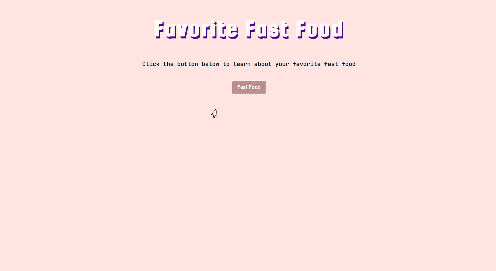

  

<h1>Favorite Fast-Food Informational Site</h1>

<h2>Overview</h2>

This simple website was created to provide information about fast food items.
 

<h2>Live Link here:</h2> 
<a href="https://th876.github.io/FavFast-Food/">Favorite Fast Food Informational Site</a>

<h2>Features:</h2> 
<ul>
  <li>Users click the button to intitiate a window prompt.</li>
  <li>Users select one of the three fast food items to learn more about it.</li>
  <li>The site accepts lower, upper and title case.</li>
  <li>Empty inputs, other food items or misspelled words are returned as errors.</li>
</ul>

<h2>Dependency:</h2>
<ul>
  <li>Font from <a href="https://fonts.google.com/">Google Fonts</a></li>
  <li>Images from <a href="https://www.pexels.com/">Pexels</a></li>
  <li> Favicon created using <a href="https://www.adobe.com/products/photoshop.html?sdid=KKQIN&mv=search&kw=photoshop&ef_id=Cj0KCQjw4v2EBhCtARIsACan3nzWa02yHOxxhoA2qyth0Ccx23VW6QLSgtmysrlXsdK-F58df6NXpr0aAmSXEALw_wcB:G:s&s_kwcid=AL!3085!3!442365419729!e!!g!!adobe%20photoshop%20home&gclid=Cj0KCQjw4v2EBhCtARIsACan3nzWa02yHOxxhoA2qyth0Ccx23VW6QLSgtmysrlXsdK-F58df6NXpr0aAmSXEALw_wcB">Adobe Photoshop</a></li> 
</ul>
